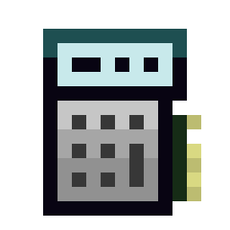

# GTNH-OC-Base-Monitor

## Note

Information in this readme was from the original fork, and is inaccurate. README WIP.

## Content

- [Information](#information)
- [Installation](#installation)
- [Setup](#setup)
- [Configuration](#configuration)

<a id="information"></a>

## Information

The program is designed to manage energy generators and energy consumers at your base.
The program is also able to monitor the wireless network in `wirelessMode` mode.
It is also possible to send messages to Discord about out of service situations.
And there is also the possibility of auto update at startup.

#### Controls

<kbd>Q</kbd> - Closing the program

<kbd>Arrow Up</kbd> - Scroll list up

<kbd>Arrow Down</kbd> - Scroll list down

#### Interface


<a id="installation"></a>

> [!CAUTION]
> If you are using 8 java, the installer will not work for you. 
> The only way to install the program is to manually transfer it to your computer.
> The problem is on the java side.

To install program, you need a computer with:
- Graphics Card (Tier 3): 1
- Central Processing Unit (CPU) (Tier 3): 1
- Memory (Tier 3.5): 2
- Hard Disk Drive (Tier 3) (4MB): 1
- EEPROM (Lua BIOS): 1
- Internet Card: 1


Install the basic Open OS on your computer.
Then run the command to start the installer.

```shell
pastebin run ESUAMAGx
``` 

Or

```shell
wget -f https://raw.githubusercontent.com/Navatusein/GTNH-OC-Installer/main/installer.lua && installer
``` 

Then select the LSC Control program in the installer.
If you wish you can add the program to auto download, for manual start write a command.

```shell
main
```

> [!NOTE]  
> For convenient configuration you can use the web configurator.
> [GTNH-OC-Web-Configurator](https://navatusein.github.io/GTNH-OC-Web-Configurator/#/configurator?url=https%3A%2F%2Fraw.githubusercontent.com%2FNavatusein%2FGTNH-OC-LSC-Control%2Fmain%2Fconfig-descriptor.yml)

<a id="setup"></a>

## Setup

> [!NOTE]  
> For easy copying of addresses, use "Analyzer" from the OpenComputers mod. Right-click on the component, its address will be written in the chat. 
> If you click on it, it will be copied.
>
> 

<br/>

To build a setup, you will need:

- Adapter: 1

The basic setup is very simple, you just need to connect the LSC with an adapter.

